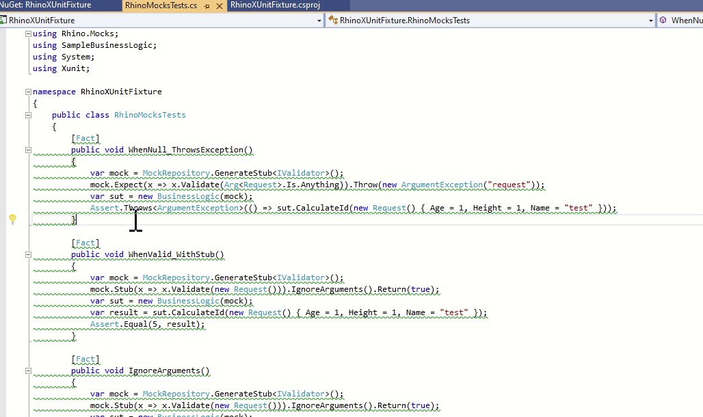

# Introduction 

A C# analyzer to update Rhino Mocks to NSubstitute


[](https://ladeak.visualstudio.com/My%20private%20projects/_build/latest?definitionId=9&branchName=master)

[](https://www.nuget.org/packages/LaDeak.TestMockUpdater/)



## Getting started

1. Add a package reference to the Test project using Rhino Mocks:

```xml
<PackageReference Include="LaDeak.TestMockUpdater" Version="*" />
```

1. Add a package reference to NSubstitute:

```xml
<PackageReference Include="NSubstitute" Version="*" />
```

Use the C# analyzer to fix and update Rhino Mocks tests.

## Supported Features

The following RhinoMocks features are converted to NSubstitute:

| Rhino Method |       NSubstitute |                                                                                   Comment |
|--------------|-------------------|------------------------------------------------------------------------------------------:|
|              |                   |                                                                                           |
|              |                   |                                                                                           |
|              |                   |                                                                                           |
|              |                   |                                                                                           |
|              |                   |                                                                                           |
|              |                   |                                                                                           |
|              |                   |                                                                                           |
|              |                   |                                                                                           |
|              |                   |                                                                                           |
|              |                   |                                                                                           |
|              |                   |                                                                                           |
|              |                   |                                                                                           |
|              |                   |                                                                                           |
|              |                   |                                                                                           |
|              |                   |                                                                                           |
|              |                   |                                                                                           |
|              |                   |                                                                                           |
|              |                   |                                                                                           |
|              |                   |                                                                                           |
